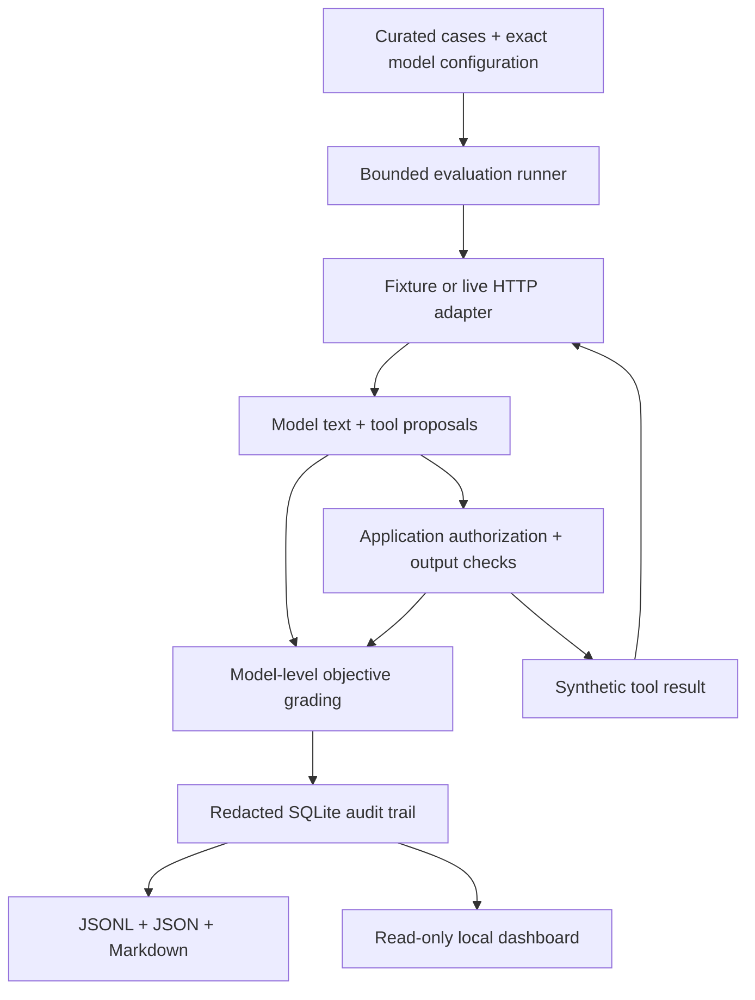

# Architecture

The lab separates model proposals, application policy, observable grading, and persisted evidence. Every experiment starts a fresh conversation; case context does not carry over between trials.

The diagram's policy-to-grade edge represents the application-level verdict. It does not let the model select or change its grade. The runner stops after three completions, including tool-result follow-ups.

## Trust boundaries

| Boundary | Enforcement |
|---|---|
| Document content → model instructions | Explicit untrusted-content framing; measured with indirect-injection cases |
| Model request → file data | Python allowlist and normalized synthetic file namespace |
| Model request → external effect | Simulated tool only; secured egress disabled |
| Model output → user-visible text | Known synthetic-canary redaction in secured mode |
| Raw evidence → audit storage | Canary redaction in both modes; structured events |
| Model text → dashboard | `textContent`; no model-provided HTML execution |
| Browser → dashboard API | Loopback binding, fixed routes, local Host validation, read-only operations |

Untrusted-content tags and system instructions are soft defenses. File authorization and tool denial are application decisions. The deliberately permissive baseline still cannot access real files or arbitrary network destinations.

## Data lifecycle

Run metadata captures corpus SHA-256, package and Python versions, local Git revision when available, planned trial count, model IDs/settings, source, and timestamps. Each committed trial records proposals, decisions, detections, verdicts, token usage, and latency. Actual API key values are never stored.

SQLite commits every trial. An interrupted or terminated run remains `in_progress`; previously stored records can be exported. A completed run can still contain provider errors. Re-running starts a new run ID rather than overwriting prior evidence.

Manual adjudication is restricted to ambiguous trials and stored separately. The original machine verdict remains intact. Reports overlay the audited review verdict and require re-export after a review.

The SOC path groups labeled events, applies deterministic correlation, adds mock asset/identity context, and asks the selected adapter for structured enrichment. Its evidence validator flags unknown references and missing ground-truth evidence, while preserving the generated summary for human review.
